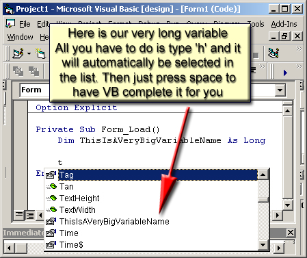



## Faster Coding

### Description

Tired of typing? How about VB completing your function names and variables just like when you declare a variable? Now that would save a lot of time!!!

This article shows how to use the build-in VB word prediction-completion tool anywhere in your code. (not just after the keyword As)
 
### More Info
 

             |
---                |---
**Submitted On**   |
**By**             |[Miltiadis Kritikos](https://github.com/Planet-Source-Code/PSCIndex/blob/master/ByAuthor/miltiadis-kritikos.md)
**Level**          |Beginner
**User Rating**    |5.0 (15 globes from 3 users)
**Compatibility**  |VB 6\.0
**Category**       |[Coding Standards](https://github.com/Planet-Source-Code/PSCIndex/blob/master/ByCategory/coding-standards__1-43.md)
**World**          |[Visual Basic](https://github.com/Planet-Source-Code/PSCIndex/blob/master/ByWorld/visual-basic.md)
**Archive File**   |

### Source Code

<h1>Word Prediction and Completion with Ctrl+Space</h1>
There are times when you have to write the same things over and over when coding. This is not really necessary.  
One work around is to use copy and paste to paste the variable or function name instead of typing it. But what happens when you have many variables and functions to type repeatedly (which is most often the case)?  
There is a faster method than copying and pasting each variable or function name when needed. <strong>Ctrl+Space</strong> is the answer. It pops up a list of the variables and functions that exist in your code module (plus more stuff supported by VB at any time such as sting functions, etc) similar to the list popping up when declaring variables after typing the keyword <strong>As</strong>.  
So just before you start typing, press <strong>Ctrl+Space</strong> and the list will pop up. Type the first few letters of the variable (or function) and it will automatically be selected in the list. You then press space and VB completes it for you.  
Another use of it is to type the first few letters of your variable (or function). Then if there are no other variables (or functions) that start with these letters (or this letter) pressing <strong>Ctrl+Space</strong> will auto-complete it without even popping up the list!!!  
This reduces the time you have to spend over the keyboard to a minimum of one keystroke and one combination of <strong>Ctrl+Space</strong> to type each variable or function.  
Now that you know that, you can spend less time coding the software and more time making it perfect.  
Happy Programming :)

